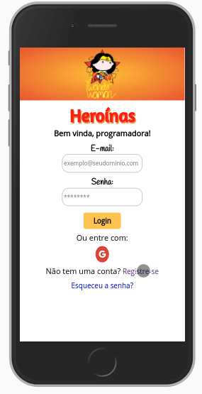

# Rede Social Heroínas

## Índice
  - [1. Resumo do Projeto.](#1-resumo-do-projeto)
  - [2. Como funciona?](#2-como-funciona)
  - [3. Histórias de Usuários Implementadas](#3-histórias-de-usuário-implementadas)
  - [4. Tempo do Projeto](#4-tempo-do-projeto)
  - [5. Template das Telas](#5-template-das-telas)

## 1. Resumo do Projeto

A Rede Social **Heroínas** é uma aplicação voltada para programadoras que desejem se conectar com outras. 

Com enfoque no empoderamento feminino, a personagem principal da rede é a Mulher Maravilha - que, agora, decidiu se desafiar e começar uma nova profissão - assim como as alunas da Laboratória! 

Quanto as **caraterísticas técnicas** foram aplicação envolveram:

O desenvolvimento desta aplicação teve enfoque em *Single-Page Application* (SPA), Mobile First e Componentização.

O projeto foi elaborado em 3 (três) semanas.

## 2. Como funciona? 

## 3. Ferramentas utilizadas
1. HTML 5
2. CSS
3. *Vanilla* JS
4. Firebase *auth*, *firestore* e *hosting*
5. Eslint

## 4. Histórias de Usuário Implementadas
 
* Como usuário novo, devo poder criar uma conta com email e senha válidos para poder iniciar uma sessão e ingressar na Rede Social.

* Como usuário novo, devo poder ter a opção de iniciar sessão com minha conta do Google ou Facebook para ingressar na Rede Social sem necessidade de criar uma conta de email válido.

* Como usuário logado devo poder criar, guardar, modificar no mesmo lugar (in place) e deletar publicações (post).

* Como usuário logado devo poder ver todos os posts que criei até o momento, do mais recente para o mais antigo.

* Eu como usuário logado, posso dar like e ver a contagem de likes em minhas publicações

* Eu como usuário logado, posso escrever, salvar, editar ou deletar um comentário em minhas publicações.

* Ao final devo poder ingressar na Rede Social e poder visualizar os dados de meu perfil criado e editá-los.
